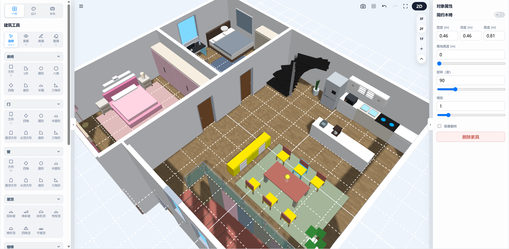
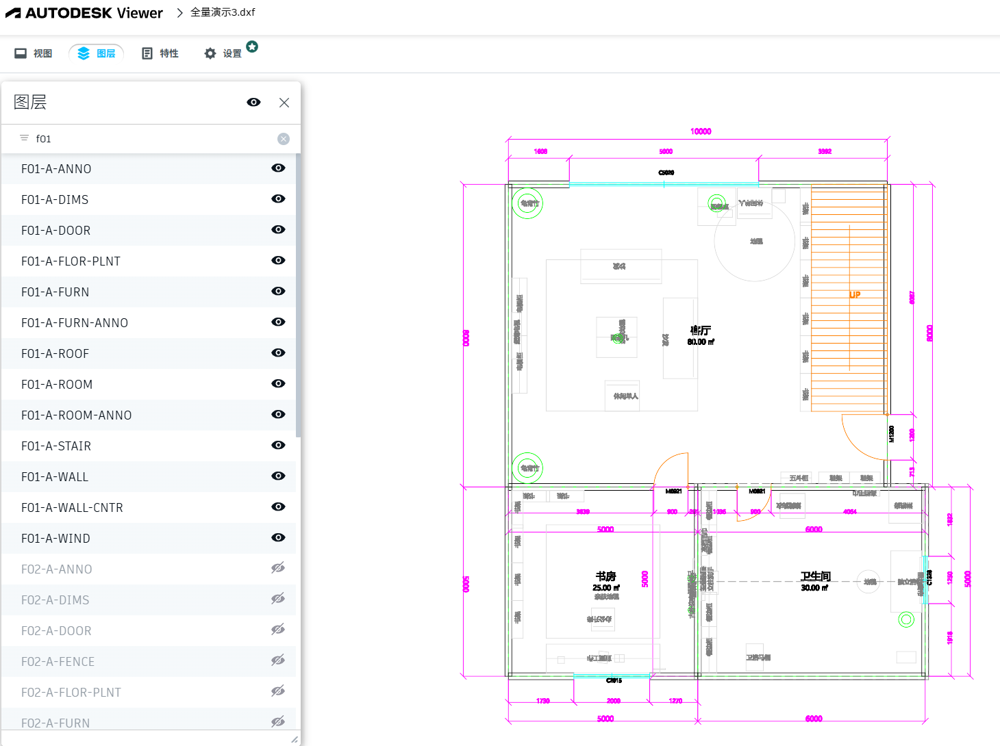
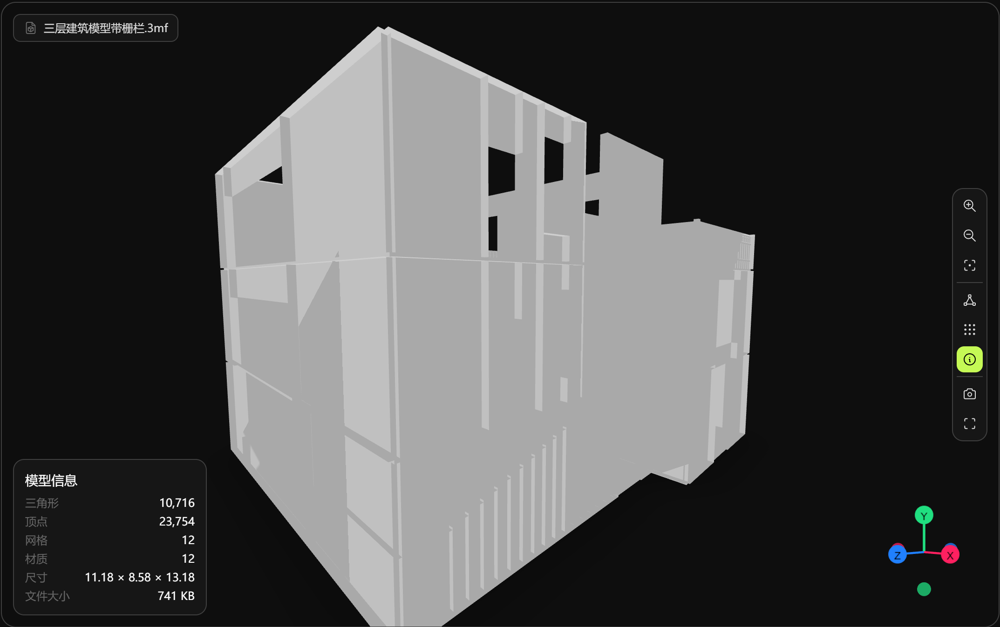

# blueprint3d

[](https://github.com/BabylonJS/Babylon.js)
[](https://vitejs.dev/)
[](https://opensource.org/licenses/MIT)
[-brightgreen?style=flat-square)](#)
[](#)

`blueprint3d-babylon` is a lightweight, modern web-focused 2D/3D blueprint architectural and interior design editing core library built on the **Babylon.js** rendering engine. Featuring efficient 2D floorplan drafting and real-time 3D scene synchronization, the project includes industrial-grade optimizations for complex wall opening CSG boolean operations, bidirectional state management, and 3D engineering data exports. It serves as an ideal open-source framework for building 3D architectural design applications, virtual home sandboxes, or metaverse interior design engines.



> **SEO Keywords**:
> `Babylon.js 3D Editor`, `3D Floorplan Editor`, `Web 3D Floorplan Editor`, `2D/3D Architectural Design Library`, `3D Interior Design Framework`, `CSG Wall Boolean Cutting`, `CAD DXF Export`, `3MF 3D Print Export`, `Frontend 3D Home Sandbox`, `Web 3D Material Eyedropper`.

---

## 🔗 Live Demo & Local Setup

### 🚀 Live Demo
*   **Live Demo URL**:currently unavailable
*   *Provides full feature demonstrations including 2D drag-and-drop, 3D navigation, appliance toggle controls, material eyedropper & section painting, CAD/3MF drawing exports, and more.*

### 💻 Local Quickstart
To run and debug the example project locally, execute the following commands in the project root directory:

```bash
# 1. Install dependencies
npm install

# 2. Start local development server (Vite-based)
npm run dev
```
Upon successful launch, open the following URL in your browser for local debugging and development:
[http://127.0.0.1:3000/blueprint3d-babylon/example/index.html](http://127.0.0.1:3000/blueprint3d-babylon/example/index.html)

---

## 🌟 Core Features

This project provides a comprehensive suite of modern 2D/3D interior decoration and floorplan design capabilities. For detailed technical implementation, algorithms, and daily usage instructions, please refer to the **[User Guide](docs/features/README.md)**.

Overview of key features:

*   🔄 **2D / 3D Bidirectional Real-time Synchronization**: Supports high-efficiency bidirectional sync between 2D SVG floorplan drawing and 3D Babylon rendering viewport, fully optimized for both desktop and mobile touch controls.
*   🧱 **Smart Wall & Room Topology**: Built-in 8 preset room shapes that automatically calculate and render enclosed physical walls, floor meshes, and real floor areas, with grid snapping and temporary drag locks.
*   ✂️ **Seamless CSG Cutters & Pick Proxy**: Dynamically generates cutters during door/window dragging for CSG boolean subtraction with seam-sealed edges; maintains low-visibility collision pick proxies for hidden glass and openings, with delayed drag calculation.
*   🚪 **Advanced Symmetrical Double Door Animation**: Automatically builds opposite-angle rotation hinges for symmetrical door panels to open in sync, avoiding expensive boolean re-computations and maximizing performance.
*   🖌️ **Smart Material Brush & Eyedropper System**: Efficient single-surface or full-package material extraction (Eyedropper); offers localized precision painting (Brush) and room-wide interior wall or batch furniture synchronization (Paint Bucket).
*   🔌 **Appliance Status & 3D Visual Effects**: Toggle appliance states in 2D/3D, triggering material glowing, rotatory swinging, micro-vibrations, and dynamic Spotlight attachment/detachment.
*   🪞 **Multi-Level Reflection & Rendering Purifying**: Supports primary/secondary pixel-level planar reflections (2048/1024 px) and dynamic metal reflection probes in high-quality rendering mode; uses parallax correction to align environment reflections while automatically filtering non-rendering noise such as coordinate axes and helper lines.
*   📐 **Multi-Floor & Industrial Data Export (CAD & 3D Print IO)**: Multi-floor management and `*.b3dbuilding.json` exporting; one-click output of multi-layer dimensioned CAD (DXF) floorplans and watertight 3D-printable 3MF files.

    | CAD Export Preview | 3MF 3D Print Model Preview |
    | :---: | :---: |
    |  |  |

---

## 🛠️ Refactoring Status & Technical Architecture

The project has successfully completed Phase 3 refactoring, establishing a clear layered architecture (`domain` data, `runtime` 3D rendering, and `editor` interaction facade) alongside strict dependency isolation rules.

For detailed architectural diagrams, dependency layering, and daily development guidelines, please refer to:
👉 **[Architecture & Refactoring Documentation](docs/refactor/02_api.md)**

---

## 📝 Core API Example

The refactored system exposes external services through a unified `EditorFacade` controller. External integrations (such as `example/app.js`) operate completely against the Facade API.

For the full API taxonomy, deprecation mappings, and `createEditor` code examples, please refer to:
👉 **[Consumer API Usage Guide](docs/refactor/consumer-api.md)**

---

## 🧪 Automated Testing

The project is configured with automated regression test cases. You can run validation locally at any time to verify core computational logic:

```bash
# Run all automated unit tests
npm run test
```

Tests cover critical modules such as `exporters.test.mjs` (CAD/3MF exporter validation), `openingVisibility.test.mjs` (door/window visibility & proxies), `roomShapes.test.mjs` (polygon topology meshes), and `appliancePower.test.mjs` (appliance toggle animation).

---

## 🤝 Contributing

We welcome developers to participate in building the `blueprint3d-babylon` open-source ecosystem. Before submitting a Pull Request, please ensure all unit tests pass (`npm run test`) and adhere to JSDoc type declaration standards.

### Future Roadmap
1. **Smart Bay Window Structure (REQ-14)**: Support placing bay windows on standard walls with accurate cutout deductions and dynamic multi-mesh merging for protruding window sections.
2. **Interactive Furniture Animation (REQ-18)**: Provide click interactions for interactive furniture (e.g., swings) to trigger physical swinging or state machine animations.
3. **Performance Optimization**: Separate texture library uploads, memory profiling, and mobile thermal/power optimization.
4. **Package Splitting**: Publish as npm packages and split into `@blueprint3d/core`, etc.

*Licensed under the MIT License.*
