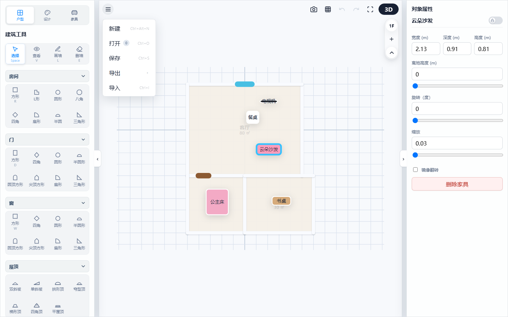
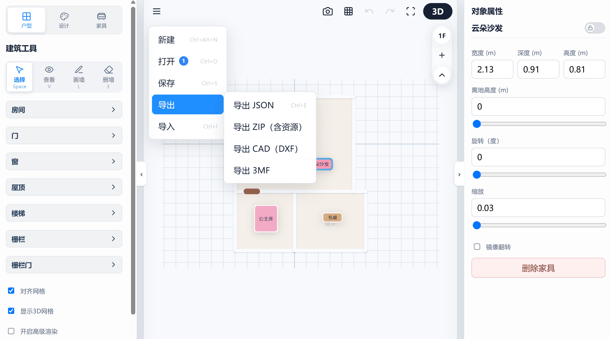
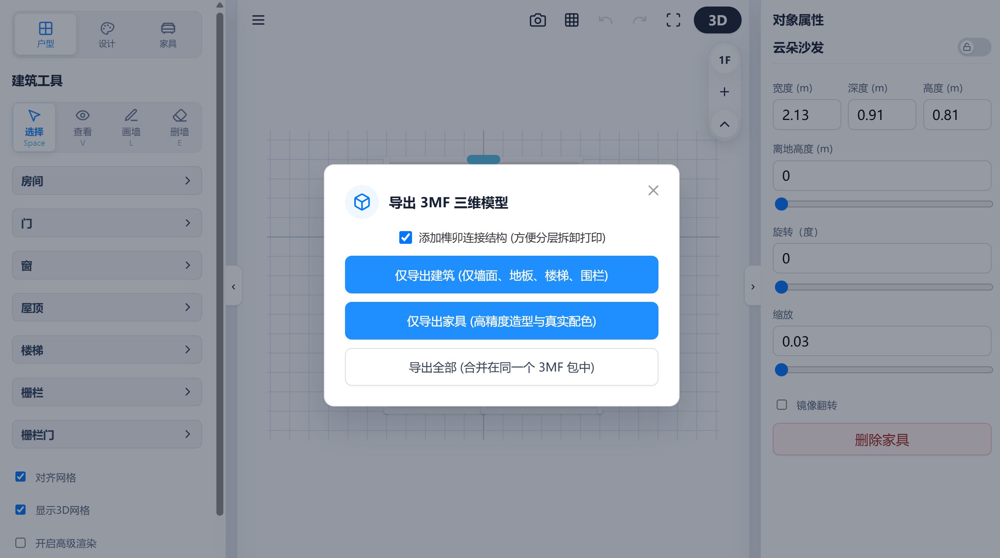

# 3D Floorplan Designer: Project Management & File Export Guide

This chapter provides a detailed overview of global file operations, data backup and history recovery mechanisms, and how to export professional manufacturing and industrial drafting format files.

---

## 1. Global Project File Management

You can manage your design projects globally via the file menu at the top of the interface:

*(Legend: Expanding file dropdown menu)*

*   **New Project (Ctrl+Alt+N)**:
    Clears all designs on the current canvas (including multi-floor definitions, all wall segments, doors/windows, furniture layouts, etc.) and resets operation history.
*   **Open Project (Ctrl+O)**:
    Loads saved project history from browser local storage (`localStorage`).
*   **Save Project (Ctrl+S)**:
    Manually enter a name to save the current design project to the local database.

---

## 2. High-Reliability Dual-Track Auto-Save System

To prevent data loss caused by browser crashes, power outages, or accidental page refreshes, a high-reliability dual-track save system is deployed:

*   **Silent Periodic Auto-Save**:
    A periodic auto-save timer running at **10-minute intervals (600,000 ms)** operates in the background. It automatically captures current building data, custom material libraries, toolbar state, and UI state, displaying a fade-in toast notification upon success.
*   **Power Outage Hard Recovery**:
    When the page reloads, the system restores all wall meshes, camera focus positions, and operation history stacks within milliseconds, ensuring zero loss of progress.
*   **80-Step Undo History Stack**:
    Records complete operation history, allowing you to use `Ctrl+Z` to undo or `Ctrl+Y` to redo across all design changes (wall addition/deletion, material painting, object displacement), supporting up to **80 steps** of history depth.

---

## 3. Professional Multi-Format Exporting

> 💡 **Usage Demo:**
> 
> 
> *(Legend: Expand top "File" menu and click Export to choose among 4 export methods)*

The designer not only serves visualization needs but also connects directly to industrial drafting and 3D manufacturing ecosystems:

### 3.1 Exporting Standardized Packages
*   **Export JSON (Ctrl+E)**: Generates lightweight custom structured data files saving hierarchy trees, wall segments, door/window position parameters, and furniture layouts.
*   **Export ZIP (with assets)**: Archives project data together with all uploaded custom material textures (Base64 format) and custom furniture into a single compressed ZIP package, ensuring custom assets are preserved across device transfers.

### 3.2 Exporting Industry-Standard CAD Drawings (DXF)
The system exports floorplans to industry-standard architectural floorplan drawings with a single click.
*   **Automatic Layer Separation**: Walls are saved to `F01-A-WALL`, doors to `F01-A-DOOR`, windows to `F01-A-WINDOW`, text and areas to `F01-A-TEXT`.
*   **Smart Geometry Rendering**: Automatically draws double-line wall faces, door swing direction arcs, dimension lines, and room area annotations in CAD drawings, seamlessly openable and editable in AutoCAD, Revit, etc.

    | CAD Export Preview |
    | :---: | 
    |  | 

### 3.3 Exporting 3D Printing Manufacturing Format (3MF)
Model files specially engineered for desktop-grade 3D printing manufacturing.
> 💡 **Usage Demo:**
> 
> 
> *(Legend: Click 3MF export to choose separate building and furniture export options)*

*   **Export Wizard & Mortise-Tenon Options**: Clicking export pops up an advanced 3MF configuration panel. Here you can choose `Add Mortise & Tenon Joints` (automatically generating physical pegs and locator holes on intersecting surfaces for Lego-like block assembly after 3D printing), supporting three extraction filtering strategies: "Export Building Only", "Export Furniture Only", or "Merge & Export All".
*   **Multi-Entity Independent Export**: Each floor and furniture item is exported as an independently named entity, preserving full RGB base material color descriptions.
*   **CSG Dynamic Cutting & Watertight Mesh Processing**: The exporter automatically inspects 3D renderer state, performing dynamic CSG (Constructive Solid Geometry) boolean cutting and edge seam sealing to guarantee watertight closed mesh topology, preventing slicer path errors (such as gaps or unclosed shells).

    | 3MF 3D Print Model Preview |
    | :---: | 
    |  |

---

## 4. Importing & Project Restoration

The system supports one-click importing of saved project files for secondary editing:

*   **Load Local Project (Ctrl+O)**: Click "Open" in the File menu or use the shortcut to select and load local `.json` data files or `.zip` compressed project packages containing Base64 textures for millisecond-level full-scene rendering restoration.
*   **Robust Fault Tolerance & Healing**: Projects perform data self-healing and watertight topology checks upon loading. If damaged mesh definitions are detected, degraded topology auto-repair is applied with non-destructive fault tolerance to maximize recovery.