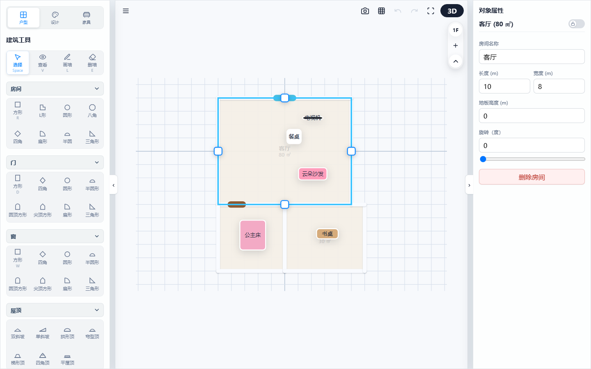
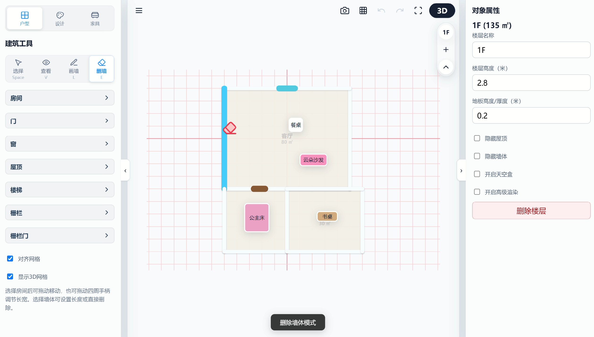
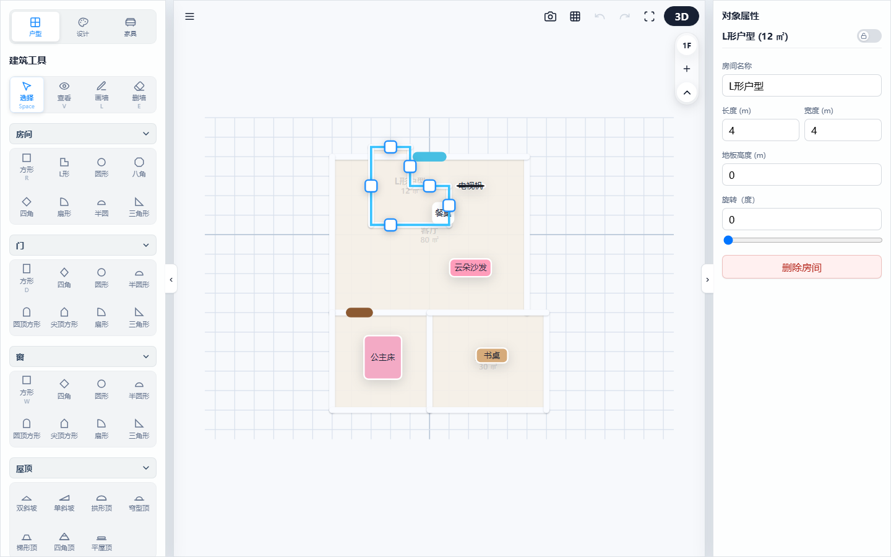
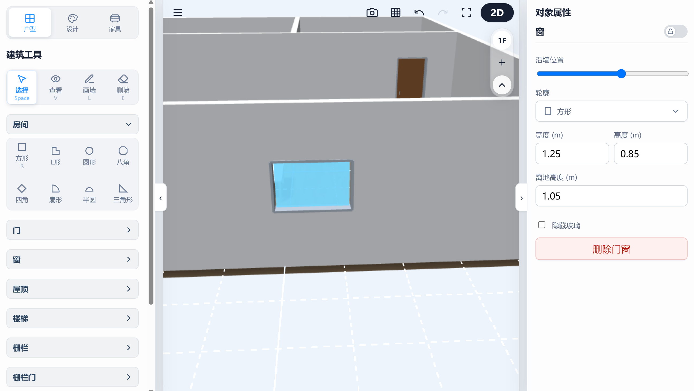
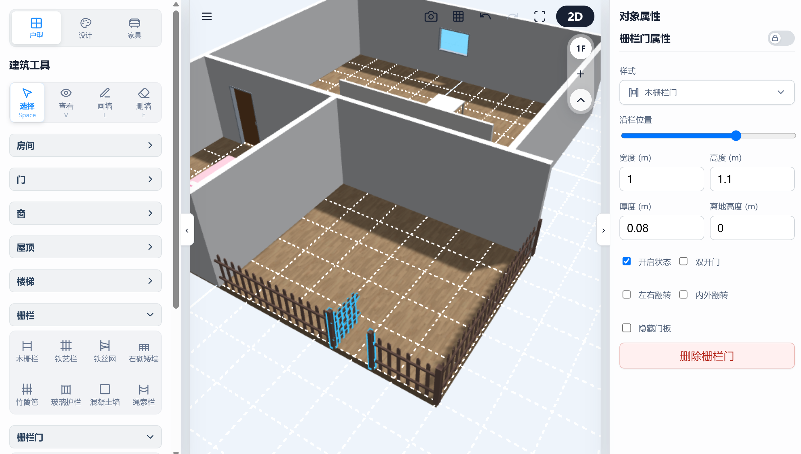

# 3D Floorplan Designer: Wall Drawing & Structural Design Guide

This chapter guides you step-by-step through drawing room walls from scratch, adding architectural structures such as doors, windows, stairs, and railings. The system supports real-time bidirectional synchronization between 2D floorplan drafting and 3D rendering.

---

## 1. Basic Drawing Modes

Switch mouse interaction modes quickly via top-left toolbar icons or keyboard shortcuts:

*   **Select Mode (Shortcut: Space)**: Default mode. Click to select any room, wall, or furniture item in the canvas and view/edit properties in the right inspector panel.
*   **Pan Mode (Shortcut: V)**: Hand cursor mode. Used to drag and move the canvas viewport to navigate around without accidentally moving objects.
*   **Draw Wall Mode (Shortcut: L)**:
    *   **2D Freehand Wall Drawing**: In 2D view, click to set a starting point, move the mouse, and click again to set an endpoint to draw wall segments continuously. Default wall height is 2.8 meters with a thickness of 18 centimeters.
    *   **Smart Grid Snapping**: Mouse movement automatically snaps to the nearest grid intersection (default step size: 0.5 meters), keeping wall angles clean and precise.
    *   **Auto Floor & Area Generation**: When multiple connected wall segments enclose a fully closed loop, the system automatically recognizes it as a "Room" and generates floor meshes. Selecting the room calculates and displays its net floor area (m²) in real-time.

> 💡 **Usage Demo:**
> 
> 
> *(Legend: Selecting an enclosed living room in 2D displays its calculated area in the right property inspector and at the 2D room center)*
> 
> *   **Multi-Floor Area Summary**: Displays total floor area for all rooms on the current floor in parentheses next to the floor header (e.g., 1F (110 m²)), giving designers an overview of usable space.
*   **Erase Wall Mode (Shortcut: E)**: Activates an eraser cursor; click any wall segment on the canvas to quickly dismantle it. Entering erase wall mode changes the grid background to a warning light-red color with an eraser cursor.

> 💡 **Usage Demo:**
> 
> 
> *(Legend: Pressing shortcut E activates Erase Wall Mode, turning grid background light red as a warning)*

---

## 2. Placing & Adjusting Architectural Components

### 2.1 Dragging Smart Room Shapes

The system provides 8 preset room shapes: **Square, L-Shape, Circle, Octagon, Diamond, Sector, Semicircle, and Right Triangle**. Drag and drop them directly onto the canvas.

*   **Adjusting L-Shaped Rooms**:
    Dragging an L-shaped room displays a unique **control handle** at the inner corner. Drag this handle to adjust cutout width and depth directly. Built-in safety limits (minimum 0.2 m) prevent structural collapse from over-dragging.
*   **Temporary Drag Lock Mechanism**:
    When dragging a room, grid snapping and topology containment algorithms automatically activate a temporary lock. This binds only the furniture contained inside the room, preventing outside loose furniture from being accidentally "ingested" when coordinates temporarily overlap.

> 💡 **Usage Demo:**
> 
> 
> *(Legend: Highlighted control handle at inner corner of L-shaped room, showing width and depth drag adjustments)*

### 2.2 Placing & Fine-Tuning Doors and Windows

Drag preset **Square Windows, Round Windows, Arch Doors, Gothic Pointed Windows**, and other custom doors/windows directly onto walls.

*   **Corner Placement**: Supports placing doors and windows directly on corner joints connecting two walls.
*   **Millimeter Keyboard Fine-Tuning**: Select a placed door/window:
    *   Use **Arrow keys (← / →)**: Nudge door/window left or right along wall plane in **5 cm** steps.
    *   Use **PageUp / PageDown**: Raise or lower window elevation vertically in **5 cm** steps (minimum sill elevation off ground: 0.1 m).
*   **Dynamic CSG Boolean Cutting & Seam Sealing**:
    Dragging doors/windows on a wall dynamically generates a 4x-thickness Cutter entity for CSG boolean subtraction. Intersecting boundaries are automatically seam-sealed to build end-cap meshes and normals, preventing light bleeding and Z-fighting.
*   **Flicker-Free Smooth Dragging (Delayed CSG Calculation)**:
    During movement, dragging, and rotation, wall re-segmentation is **deferred** to maintain smooth 60fps visuals without white flicker. Only parent wall nodes (`TransformNode`) and child door/window `position` / `rotation` are updated until the user **releases the mouse**, triggering a full `build` recalculation and CSG cut.
*   **Advanced Double Door Symmetrical Animation**:
    For `doubleDoor` configurations, opposite-angle rotation hinges are created on left and right sides to swing symmetrically open in sync. Base vertex data is split on the X-axis without expensive boolean ops, maintaining high rendering performance.

> 💡 **Usage Demo:**
> 
> 
> *(Legend: Selecting a window on a wall in 3D view shows highlighted bounding box handles and fine-tuning panel on the right)*

### 2.3 Modular Stairs & Smart Railing Openings

*   **Modular Stairs**: Straight, Floating, L/U-Turn, 3D Spiral, and Curved Stairs. Step panels and support base materials are independently separated, with seamless corner landing joints to prevent clipping.
*   **Smart Railing Gate Openings**: Dragging a gate onto a drawn railing segment automatically snaps and **intelligently cuts the railing**, hiding intersecting posts to leave a clean walkway opening.

> 💡 **Usage Demo:**
> 
> 
> *(Legend: Gate snapping and cutting railing posts and fence panels in 3D view)*