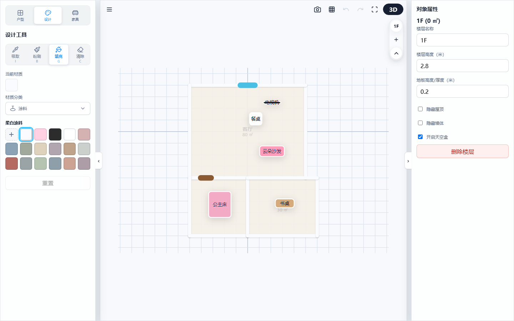
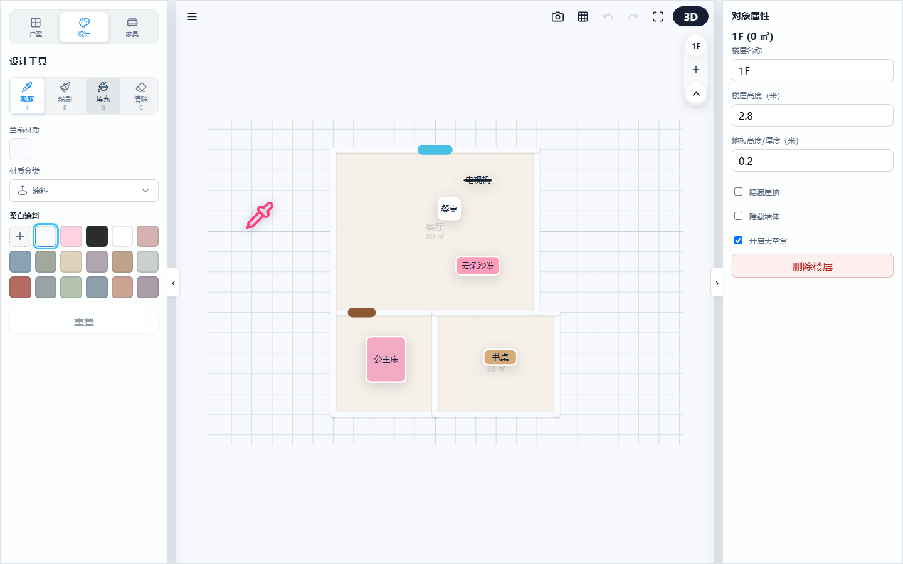
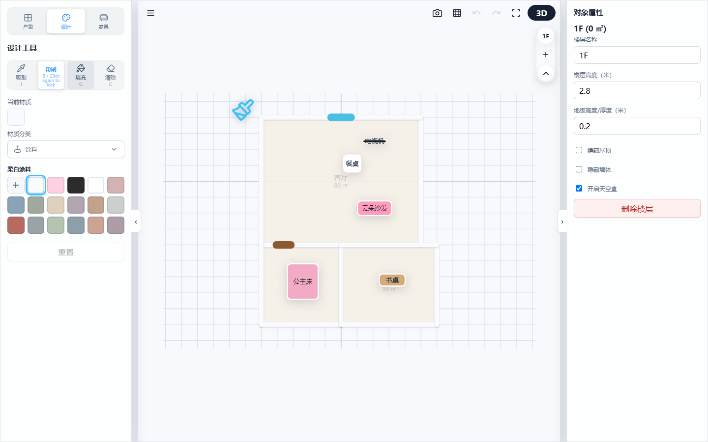

# 3D Floorplan Designer: Material Editing & Surface Painting Guide

The system provides powerful material painting and color picking tools to help you rapidly customize colors and textures across walls, floors, ceilings, and furniture.

---

## 1. Core Material Design Tools

At the top of the design panel, you can select from four professional painting tools:

| Tool Name | Shortcut | Function Description | Use Case |
| --- | --- | --- | --- |
| **Material Eyedropper** | **I** | Click any model surface to penetrate complex furniture groupings for **precise pick** (extracting target SubMesh material) or **full pick** (extracting all furniture materials as an array). Right-clicking furniture copies a full material snapshot. | Copying existing furniture color/texture combos |
| **Material Brush** | **B** | Paints the currently selected material or color onto individual component surfaces clicked by the mouse. The cursor dynamically renders a synchronized gradient or solid paint pointer across CSS and SVG layers based on selected materials. | Localized detail coloring |
| **Smart Paint Bucket** | **G** | **Spatial Room-Aware Large Surface Painting**: 1. Click interior wall faces to recognize the room and replace **all interior walls** of that room without affecting exterior walls. 2. Click furniture to **synchronize all matching furniture** across the entire house. Cursor also supports dynamic gradient/solid rendering across CSS/SVG layers. | Rapid full-room wall layout or house-wide furniture style synchronization |
| **Material Eraser** | **C** | Clears custom materials on specific surfaces, restoring factory default base colors and textures. | Design reset and restoration |

> 💡 **Usage Demo:**
> 
> 
> ### 💡 In-Depth Guide: Eyedropper Tool vs. Right-Click / Long-Press Menu Extraction

To deliver the smoothest material extraction experience, two color-picking workflows are provided:

| Feature | Eyedropper Tool (Shortcut: I) | Right-Click / Long-Press Menu "Extract Material" |
| :--- | :--- | :--- |
| **Interaction Mode** | **Precision Tool Flow**. Activating eyedropper turns mouse into an eyedropper cursor to pick component materials directly. | **Quick Copy Flow**. Copy material arrays via right-click/long-press menu without switching tools. |
| **Use Case** | When you need to **pick color precisely from a specific component**. | When arranging furniture and wanting to **copy material presets quickly** without breaking workflow. |
| **Behavior** | Extracts a single "current material" and activates a paint brush for immediate painting. | Copies the item's full material array to "current material", supporting sequential painting to other furniture/components. |

> 💡 **Usage Demo:**
> 
> | Eyedropper Hover Cursor (Shortcut: I) | Gradient Brush Cursor (Shortcut: B) |
> | :---: | :---: |
> |  |  |
> | *(Legend: Mouse cursor turns into an eyedropper when activated)* | *(Legend: Cursor turns into a gradient paint brush after picking)*

---

## 2. Custom Material Upload & Anti-Stretching (Adaptive UV)

Upload local JPG or PNG images as custom wallpapers or floor tile textures.

*   **Smart Anti-Stretching Mechanism (Adaptive UV)**:
    Painting an image onto large walls or floors automatically detects surface aspect ratios. Exceeding safe ratios triggers **automatic tiling repetition (Tiling Compensation)** along the major axis, keeping texture patterns in proportion without stretch distortion or inversion errors.
