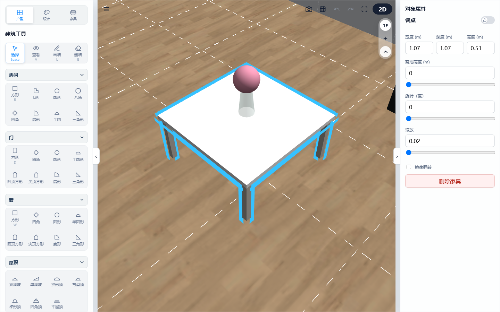
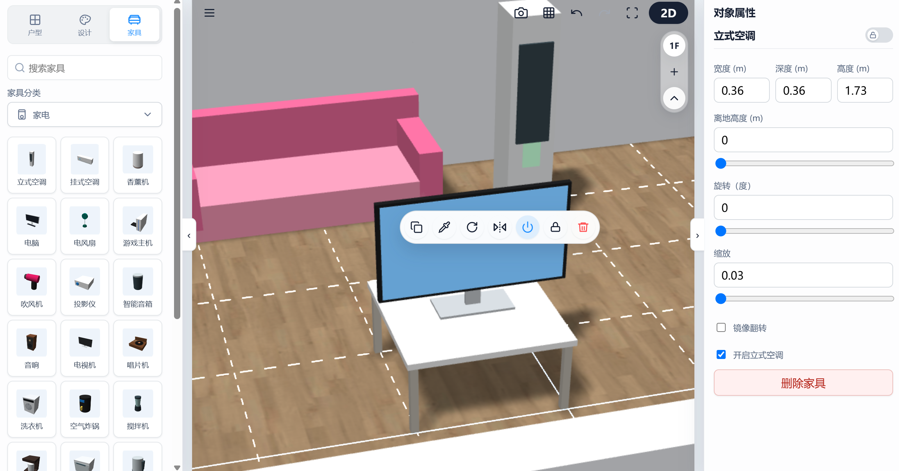

# 3D Floorplan Designer: Furniture Placement & Smart Appliances

This chapter introduces searching and placing furniture assets, detailing automated features such as "Smart Small Decor Gravity Snapping" and "Appliance Visual Effects Integration".

---

## 1. Smart Decor "Gravity Snapping"

When placing small decor items like cups, books, or paintings, manual vertical adjustment is not required:

*   **Automatic Surface Lock**: Moving decor near table tops, shelf dividers, or bookcase shelves triggers gravity snapping, **automatically snapping elevation to the nearest shelf surface**, centering depth, and constraining bounds within side panels. This eliminates floating objects or clipping into tables.
*   **Hierarchy Tree Following**: Moving or rotating a base table/bookshelf causes all decor snapped on its surface to follow automatically without manual re-adjustment.

> 💡 **Usage Demo:**
> 
> 
> *(Legend: A small vase item automatically snapping to a round coffee table surface in 3D view)*
*   **Bookshelf Auto-Fill Books**: Selecting a shelf or bookcase and clicking "Auto Fill Books" automatically calculates net depth and width per shelf cell, randomly arranging books of varied thickness and height until space limits are reached.

---

## 2. Appliance Audiovisual Effects & Animations

Selecting appliances (TVs, electric fans, projectors, record players) and turning on the **power switch in the property panel** triggers dynamic interactive visual effects:

```
[Appliance Power ON] 
    │
    ├──> 📺 TV / Screen      ───> Screen self-luminescence + breathing indicator pulse (0.35 ~ 1.0)
    ├──> 🎛️ Turntable / Audio ──> Record constant rotation + speaker high-frequency micro scaling
    ├──> 🎛️ Blender / Mixer  ──> 30Hz high-frequency, 3mm amplitude physical micro-vibrations
    ├──> 🍃 Electric Fan     ──> 1.5 rad/s oscillating head rotation animation
    └──> 📹 Projector / TV   ──> Smart spotlight mounting, light intensity & orientation synced with movement
```

> 💡 **Usage Demo:**
> 
> 
> *(Legend: Powered-on TV emitting screen luminescence, with power toggle checked in the right panel)*
