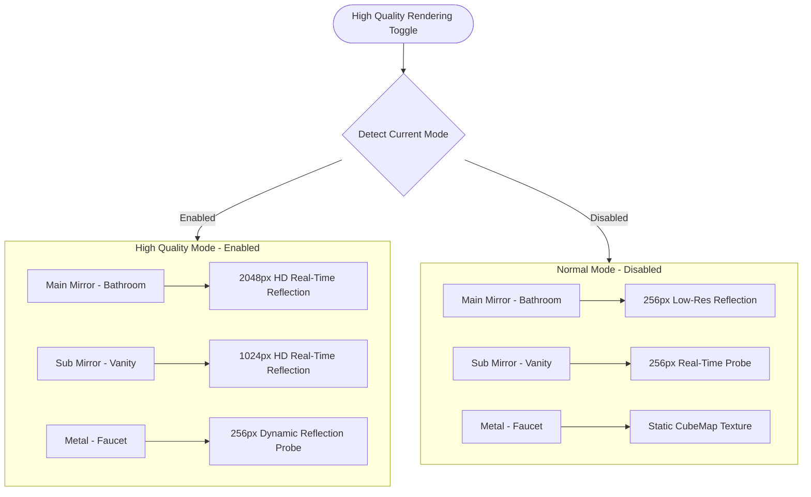
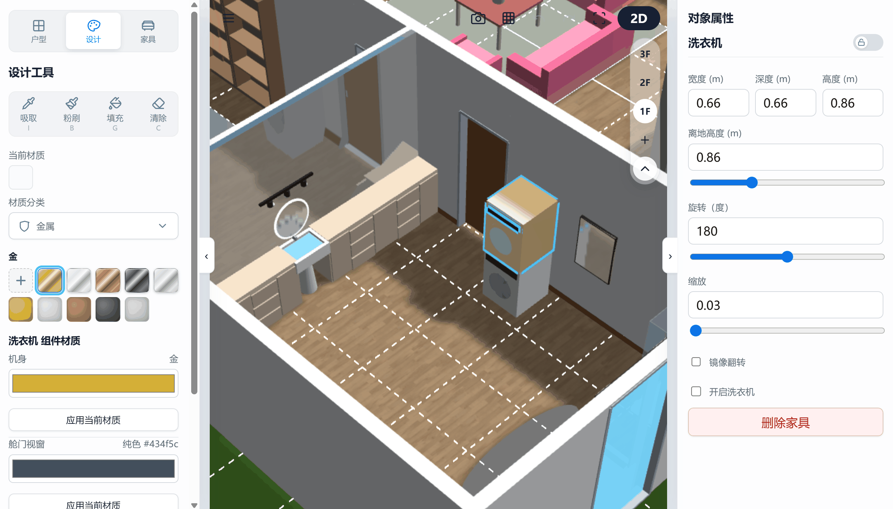
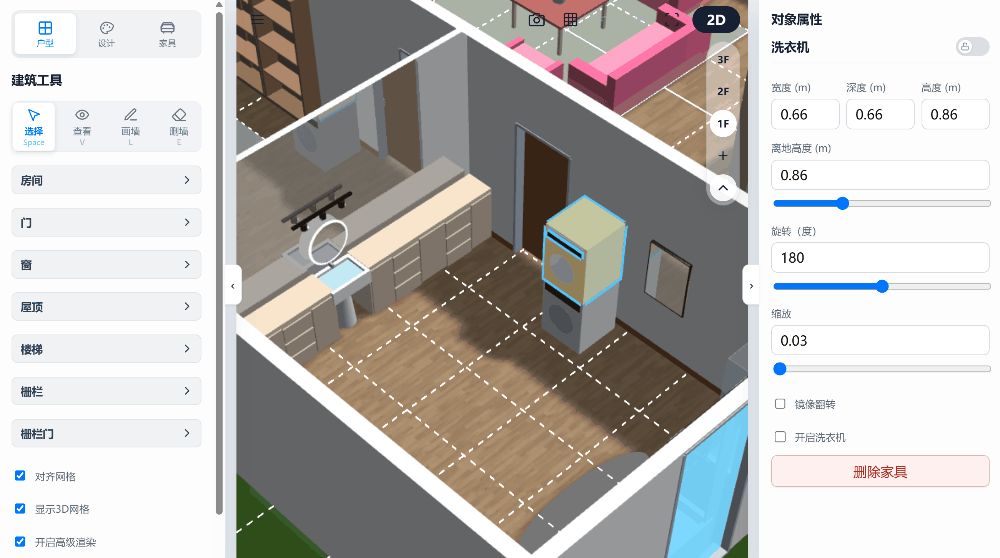
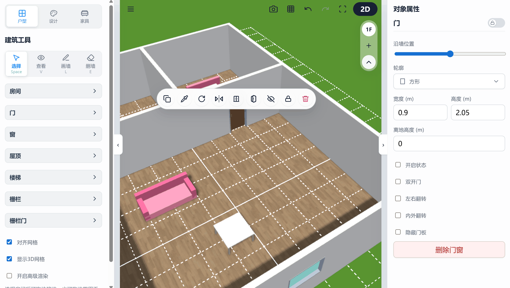

# 3D Floorplan Designer: Camera Navigation & Advanced Rendering Guide

This chapter details multi-dimensional camera view switching, first-person navigation, advanced reflection rendering, and adaptive rendering quality hot-swapping algorithms.

---

## 1. Viewport Interaction & Gesture Isolation

While supporting flexible touch controls, the system enforces gesture conflict isolation:

*   **Multi-Touch Gesture Isolation**: Supports two-finger touch rotation, panning, and zooming of the 3D viewport on mobile/tablet devices.
*   **Pointer Exclusive Lock**: Dragging objects on mobile/touch screens automatically detaches camera controls (`detachControl`) via exclusive pointer capture. This guarantees that dragging objects on touch screens never causes background 3D camera jitter, seamlessly restoring camera control upon drag end.

---

## 2. First-Person Immersive WASD Navigation

Switch to first-person view for immersive walk-through experiences in your designed space:

*   **Keyboard Controls**: Use **W, A, S, D** or Arrow keys to walk through rooms, and drag mouse to look around.
*   **Eye Height Locking**: Absolute camera vertical height is locked to comfortable ergonomic eye level (**1.6m to 1.65m** off ground), simulating realistic human perspective.
*   **Capsule Collider Anti-Clipping**: Navigation camera mounts an invisible capsule collider with a **0.3m** radius. Approaching walls or furniture triggers physical interception, preventing wall clipping. When door leaves are open, collision blocks at the opening automatically disable for free passage.

> 💡 **Usage Guide:**
> Click the view mode button (switch to first-person icon) at the top-right of the main interface to drop down to 1.65m height. In walk mode, Q/E keys fine-tune eye level up/down to inspect shelf and cabinet mounting heights. *(Note: First-person mode is currently in Beta)*

---

## 3. Multi-Level Reflection Rendering Schemes

Enabling "High Quality Rendering" applies physical grading to mirror and metal reflections, balancing rendering quality and frame rate:

* 🪞 **Multi-Level Reflection Strategy & Resolution Grading**:
    *   **High Quality Toggle**: Integrated "Enable High Quality Rendering" toggle in UI, supporting **low-latency dynamic hot-swapping** of scene reflection textures without restarting renderer, automatically managing underlying textures and observer lifecycles to prevent memory leaks.
    *   **Planar Reflection Materials (`kind === 'mirror'`) Resolution**:
        *   **High Quality Enabled**:
            *   **Primary Mirror** (e.g., Bathroom mirrors, `isMainMirror`): Upgraded to **2048 px** HD real-time planar reflection for smooth, high-fidelity mirrors.
            *   **Secondary Mirrors** (other mirrors): Upgraded to **1024 px** high-clarity planar reflection.
        *   **High Quality Disabled (Normal Mode)**:
            *   **Primary Mirror**: Degraded to **256 px** low-resolution planar reflection `MirrorTexture` for performance on lower-end devices.
            *   **Secondary Mirrors**: Degraded to **`ReflectionProbe` (Regional Reflection Probe)** for approximate environment reflections.
    *   **Metal Reflection Materials (`kind === 'metal'`) Grading**:
        *   **High Quality Enabled**: Upgraded to **`ReflectionProbe`**, offering dynamic specular reflections with physical depth.
        *   **High Quality Disabled (Normal Mode)**: Restores metal to static **CubeMap** environment textures (cloned from `materials.js` backup), preserving base diffuse and specular colors.

  | Normal Rendering Mode |
  | :---: | 
  |  | 
  | *(Legend: Painting objects with mirror or metal materials displays dynamic reflection effects)* |

  | High Quality Rendering Mode |
  | :---: | 
  |  | 
  | *(Legend: Toggling High Quality Rendering at bottom of floor properties displays refined reflections)* |

---

## 4. Right-Click / Long-Press Context Menu & Pick Proxy

*   **Hidden State Pick Proxy**:
    When door panels or window glass are hidden via context menu, destroying meshes or setting `isPickable = false` would prevent users from clicking in 3D view to show them again.
    The system maintains a low-visibility (`visibility = 0.001`), pickable (`isPickable = true`) bounding collision proxy at the original location. This stays visually invisible while allowing right-clicking the space to invoke the context menu and select "Show".

### 💡 Context Menu Action Reference

Right-clicking (long-pressing on mobile) entities in 2D or 3D view opens context menus:

 

---

| Entity Type | Context Menu Action | Description |
| :--- | :--- | :--- |
| **All Entities** | **Duplicate** | Duplicates entity at an offset point nearby. |
| | **Pick Material** | Extracts current material array and enters paint mode. |
| | **Rotate** | Rotates 90 degrees clockwise. |
| | **Flip** | Flips symmetrically left-to-right. |
| | **Lock** | Disables entity modifications (movement & painting), while allowing duplication and material picking. |
| | **Delete** | Destroys entity. |
| **Doors** | **Single/Double** | Toggles single/double door style. |
| **Doors** | **Open/Close** | Toggles door open/closed state. |
| **Doors, Windows, Curtains** | **Show/Hide** | Toggles visibility of door panels, window glass, and curtains without disabling pick selection. |
| **Furniture: Appliances** | **Turn On/Off** | Toggles appliance visual animations and effects. |
| **Furniture: Sinks** | **Drain/Fill Water** | Controls sink water level surface. |
| **Furniture: Plants** | **Change Season** | Cycles through Spring, Summer, Autumn, Winter color presets. |
